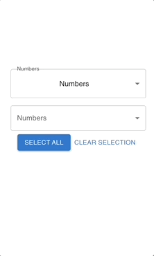
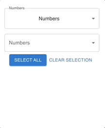
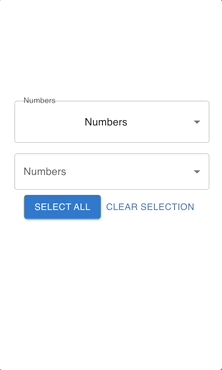
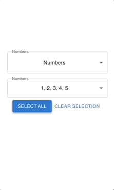
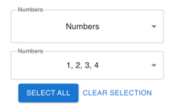
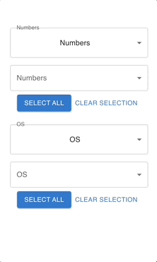

# Frontend Engineer Challenge

Ayman Kassab
<br/>
University of Waterloo - Computer Science + SoftEng option
<br/>
<a href="mailto:aymkas@gmail.com">aymkas@gmail.com</a>

This project was bootstrapped with [Create React App](https://github.com/facebook/create-react-app).

## The Component

### Signature & Input
`<DoubleDropDown defaultGroup={<SOME_KEY_FROM_GROUPS> groups={<GROUPS>}/>`
#### `<SOME_KEY_FROM_GROUPS>`:
- `<SOME_KEY_FROM_GROUPS>` must be a key in `<GROUPS>`.

#### `<GROUPS>`:
- A dictionary, containing an integer/string list-value for every key.
- Cannot have zero entries.

### Usage:
```
...
function App() {
    const groups = {
        Numbers: [1, 2, 3, 4, 5],
        Letters: ["A", "B", "C", "D"],
    };
    
    // The default group
    const defaultGroup = "Numbers";

    return (
        <div className="App">
            <header className="App-header">
                <DoubleDropDown defaultGroup={defaultGroup} groups={groups} />
            </header>
        </div>
    );
}
...
```

## Requirements

### i) A user should be able to open and close the dropdown menu.
Simply select outside of the menu:



### ii) The component must support a single selected option or multiple selected options.
- I could have created a single component that handles both single selected and multiselected options, but this would mean having many `if/else` statements in the code. I find this anti-pattern. To handle this I created two components - `MultiSelectDropDownMenu` and `SingleSelectDropDownMenu`.
- However, these components must be used together - see `SubGroupDropDown` for reference.

#### Please demonstrate both use cases separately.
Single-select shown in the first menu. Multi-select shown on the second menu:
<br/><br/>


### iii) A user should be able to select and deselect all options at once.
#### Select All:


#### Deselect all:


### iv) The selected option or options must be visible when the dropdown is closed.


### v) The component should have a flexible API, making it reusable across different parts of one or more applications. Consider it part of a component library.
```
...
function App() {
...
    // The default group for group1
    const defaultGroup1 = "Numbers";
    const groups1 = {
    Numbers: [1, 2, 3, 4, 5],
    Letters: ["A", "B", "C", "D"],
    };

    // More examples to demonstrate flexible API
    const defaultGroup2 = "OS";
    const groups2 = {
        Colors: ["red", "orange"],
        OS: ["Iphone", "Android"],
    };

    return (
        <div className="App">
            <header className="App-header">
                <DoubleDropDown defaultGroup={defaultGroup1} group={groups1} />
                <br/>
                <DoubleDropDown defaultGroup={defaultGroup2} group={groups2} />
            </header>
        </div>
    );
}
...
```


### vi) The component should not perform excessive computations. The component should render large lists efficiently.
    
To avoid excesses re-rendering of the menus, I React.memo to wrap the `<MultiSelectDropDown.../>` and `<SingleSelectDropDown.../>` component, preventing these components from re-rendering each time the group name (Numbers/Letters/OS/Color) doesn't change.

So, if an update occurs on the page
and no values/props given to the `<MultiSelectDropDown.../>` component
changes, then the MultiSelectDropDown will not be re-rendered!


The `useState` hook is also used throughout the `DoubleDropDown` component.
"The React useState Hook allows us to track state in a function component. State generally refers to data or properties that need to be tracking in an application." - w3schools

### vii) You are encouraged to include any additional features that you believe are semantically or aesthetically crucial to a dropdown component.
#### Select and un-select:


### Other
Included Mobile friendly UI through the use of MaterialUI. 
For readability, I  used Prettier to make the code style consistent and took advantage of Github's branches, PRs, and commits while developing.

## Developed/ Tested On
- CPU OS: MacBook Apple M1 Big Sur 11.1
- Node v18.1.0 and npm v8.8.0
- Google Chrome 100.0.4896.127 (Official Build) (arm64)
- React via Create React App

## Available Scripts

In the project directory, you can run:

### `npm install`
Installs all dependencies from package.json.

### `npm start`

Runs the app in the development mode.\
Open [http://localhost:3000](http://localhost:3000) to view it in your browser.

The page will reload when you make changes.\
You may also see any lint errors in the console.

### `npm run build` (Optional)

Builds the app for production to the `build` folder.\
It correctly bundles React in production mode and optimizes the build for the best performance.

The build is minified and the filenames include the hashes.\
Your app is ready to be deployed!

See the section about [deployment](https://facebook.github.io/create-react-app/docs/deployment) for more information.

